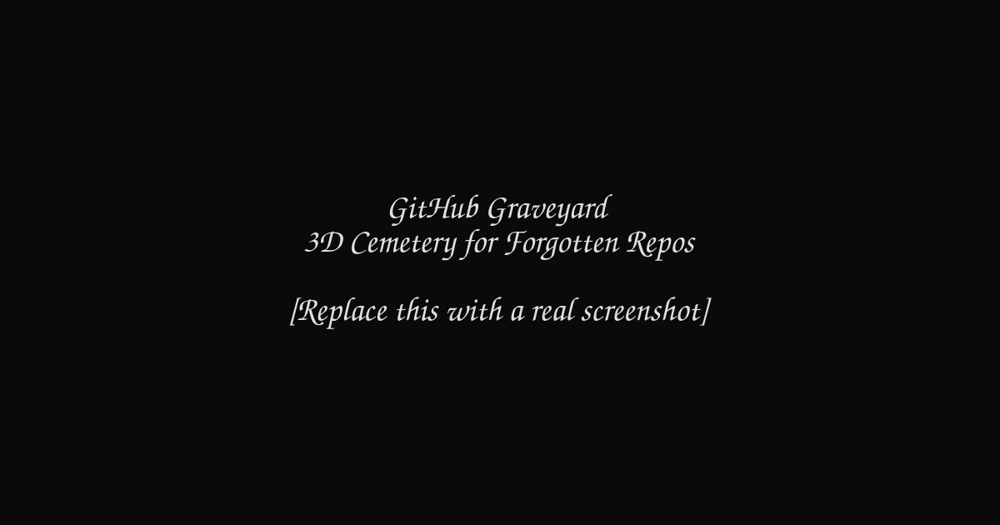

# GitHub Graveyard 🪦

> *"Every repo has a story. Some are just resting."*

A hauntingly beautiful 3D interactive cemetery where forgotten GitHub repositories lie in eternal rest. Wander through the fog, read the epitaphs, and click any tombstone to resurrect a dead project by opening a resurrection issue.

[](https://synthalorian.github.io/github-graveyard/)
[](LICENSE)
[](https://threejs.org/)



## ✨ Features

- 🌙 **Atmospheric 3D Cemetery** — Procedurally generated fog, dead trees, and moonlit tombstones
- 🪦 **Real Graveyard Data** — Fetches actual abandoned repositories from GitHub (0 stars, last pushed before 2023)
- 🖱️ **First-Person Exploration** — WASD movement + mouse look (click to lock pointer)
- 💀 **Interactive Tombstones** — Hover for repo details, click to open a resurrection issue
- 🎨 **Canvas-Rendered Epitaphs** — Each tombstone displays the repo name, language, death date, and star count
- 📱 **Responsive** — Adapts to any screen size with pixel-ratio awareness
- 🔄 **Graceful Fallbacks** — GraphQL → REST API → mock data if all else fails

## 🛠️ Tech Stack

| Layer | Technology |
|-------|------------|
| 3D Engine | [Three.js](https://threejs.org/) |
| Build Tool | [Vite](https://vitejs.dev/) |
| APIs | GitHub GraphQL + REST |
| Styling | Inline CSS (zero dependencies) |
| Deployment | GitHub Pages |

## 🚀 Installation

```bash
# Clone the repository
git clone https://github.com/synthalorian/github-graveyard.git
cd github-graveyard

# Install dependencies
npm install

# Start the dev server
npm run dev
```

## 🎮 Usage

1. Open the app in your browser
2. **Click anywhere** to lock your mouse pointer and enter the cemetery
3. Use **W A S D** to walk around
4. **Hover** over tombstones to see repo details
5. **Click** a tombstone to open a GitHub issue suggesting resurrection

> **Note:** The GitHub API has rate limits. If you see mock tombstones, the API quota has been exceeded. Wait a minute and refresh.

## 🧟 How It Works

1. **Data Collection** — On load, the app queries GitHub for repositories with 0 stars that haven't been pushed since before 2023, sorted by least recently updated.
2. **3D Scene** — Three.js renders a foggy night scene with a bumpy ground plane, scattered dead trees, and a grid of tombstones.
3. **Epitaph Generation** — Each tombstone gets a canvas texture with the repo's name, primary language, "death" year, and star count.
4. **Interaction** — Raycasting detects hover and click events on tombstones. Clicks open a pre-filled GitHub issue in a new tab.
5. **Fallbacks** — If the GitHub GraphQL API fails, it falls back to the REST Search API. If that fails too, it generates mock tombstones so the cemetery is never empty.

## 🤝 Contributing

Contributions are welcome! Whether it's a bug fix, a new feature, or a spookier atmosphere, feel free to open a PR.

Please read [CONTRIBUTING.md](CONTRIBUTING.md) for guidelines.

## 📄 License

[MIT](LICENSE) © [synthalorian](https://github.com/synthalorian)

---

*May your repos never end up here.* 🕯️

---

## ☕ Support the Developer

If this project saved you time, solved a problem, or just made your day a little more neon, you can fuel the next one:

[](https://buymeacoffee.com/synthalorian)
